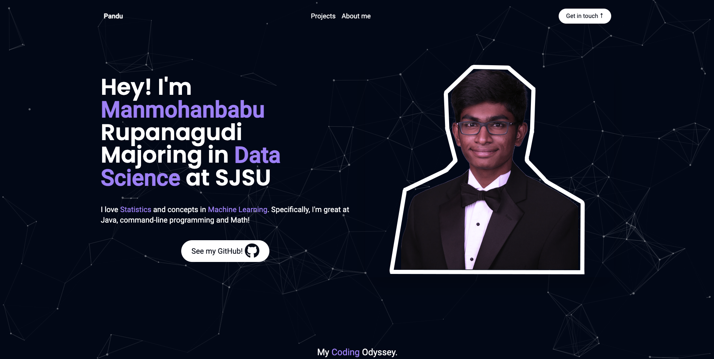

# My svelte-kit-portfolio wesbite
This repository contains the files, code, and assets that I used to create my [portfolio website](https://svelte-kit-portfolio-pandu-0-manmohanbabu-rupanagudis-projects.vercel.app/).

The website contains:
* About Me
* Projects
* Skillset
* Contact Info

[Tutorial](https://www.youtube.com/watch?v=-2UjwQzxvBQ) that made it possible to for me to make this website!

Thanks to [Smoljames](https://www.youtube.com/channel/UCPBK_brqoVQtO-fOWpxQGXw) on YT! You're awsome :))

Particle effect used in the website is from [here](https://vincentgarreau.com/particles.js/).

Website is deployed through [Vercel](https://vercel.com/).

Here's the website preview:  

